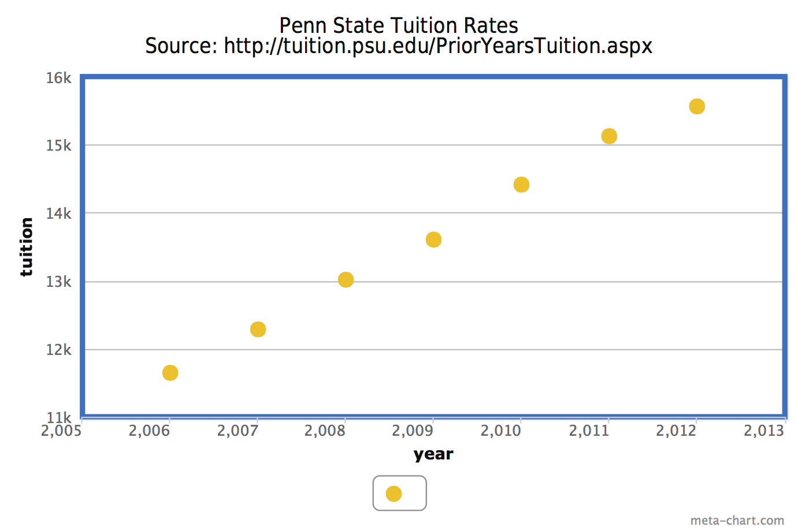

:title: Hovercraft! demo
:data-transition-duration: 1500
:css: hovercraft.css

This is a demo for Hovercraft! You can view it as a finished presentation
at http://regebro.github.com/hovercraft/

It's also useful as an example, in which case it's supposed to be read as
`source code <../_sources/examples/hovercraft.txt>`_.

You can render this presentation to HTML with the command::

    hovercraft hovercraft.rst outdir
    
And then view the outdir/index.html file to see how it turned out.

If you are seeing this text, and not reading this as source code, you are
doing it wrong! It's going to be confusing and not very useful.

Use The Source, Luke! But first you probably want to read through the
official documentation at https://hovercraft.readthedocs.org/

----

CAS 100B Group Constructed Presentation:
========================================

Names
-----

.. note::

    Welcome to the presenter console!

----

:data-rotate: 90

Problem Description and Analysis:
=================================

* To maintain the current cost of tuition, Pennsylvania State University must stop unnecessary spending.

.. note::

    Here you have a view of the current slide, a preview of the next slide
    and your notes.

----

* We will refer to Pennsylvania State University as Penn State
* For simplicty when we refer to tuition, we mean Freshman and Sophomore instate tuition costs
* As of the 2013-14 School term tuition is $8,045 (add source)
* When we refer to State aid we mean the aid that the State gives to the University 

.. note::

    If you click on the timer it restarts from zero. This is handy when you
    are rehearsing the presentation and need to make sure it fits in the time
    allocated.

----

----

* Penn State's careless spending is causing tuition to continue to increase each year
* This is harmful to us as students

----

* As tuition is raised, students take out more loans
* Puts us further in debt in order to obtain a degree

----

* Simply put as we leave school our income cannot pay back what we owe for our education

----

:data-rotate: -90

Generating and Elaborating on Possible Solutions:
=================================================

* Large student group with a small executive board that is able to speak with those making financial decisions
* Create a student group to discover and boycott any unnecessary spending

----

* Eliminate constant construction and focus on only most needed projects. For instance, The HUB rennovations are costly and wasteful
* Stop raising the salaries of administrative chairs and athletic coaches and directors. James Franklin will make 4.5 million a year for six years, He is the 7th highest paid college football coach

----

* Students are overpaying for food with the campus meal plan (lower food costs)
* Place the full allocation of PSU spending budget all over campus to raise awareness
* Increase State funding

----

:data-rotate: 90

Evalute Possible Solutions:
===========================

* The best way to use all these solutions in combination is to form a small group to raise awareness/boycott/ and change the unncessary spending of PSU

----

* Best Solution: Small student group (initially) to raise awareness of student tuition concerns and why Penn State has such high costs and send a petition to Penn State's Board of Trustees

----

* Best way is to start with a dedicated group of students and grow the small group. A small group will still exist in the group as the executive board.
* Continual newsletters and updates about reducing tuition will keep people involved. There's a direct desire for students to pay less. Fear, uncertainty, and doubt will scare people into joining.

----

:data-rotate: -90

Consensus Decision Making:
==========================

* Create a small diverse group to look at PSU budge and look for misuse of funds and hold people accountable for misspending

----

:data-rotate: 90

Implementing The Solution:
==========================

* Small group can post stall stories and allocated budget all over campus
* Small group can petition to administrative and state officials

----

Steps to Implement:
===================
1. Form a small group, containing a faculty member
2. Create the Organization
3. Create an Executive Board, Each board member will hold a position in specific areas useful to the cause

----

4. Gather a large amount of general group members
5. Create petition to create higher awareness and support the cause
